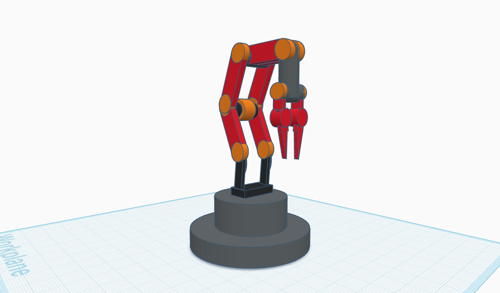

## 5-DOF Robotic Arm Design

This repository contains the 3D design of a 5-Degree-of-Freedom (DOF) robotic arm created using [TinkerCAD](https://www.tinkercad.com/).

### 📁 Contents

- `Robotic-Arm.stl` – Exported 3D model of the robotic arm (STL format)
- `image.png` – Preview image of the assembled model

### 🔧 Technical Overview

- **Degrees of Freedom:** 5  
- **Tool Used:** TinkerCAD (Browser-based 3D modeling)
- **Design Focus:**
  - Simulated base rotation
  - Shoulder and elbow articulation
  - Wrist pitch or yaw
  - Gripper positioning
- **Status:** Concept design

### 🎯 Objective

The aim of this project was to design a functional and balanced 5-DOF robotic arm structure suitable for basic manipulation tasks.

## 📷 Preview

